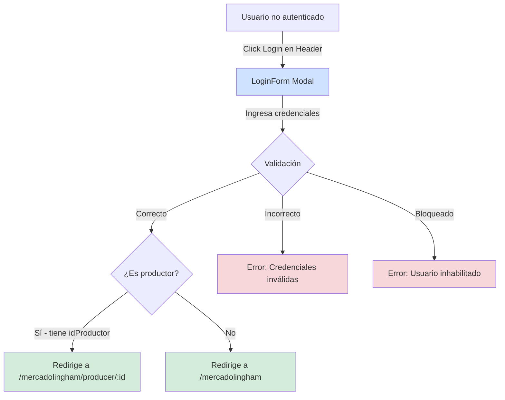
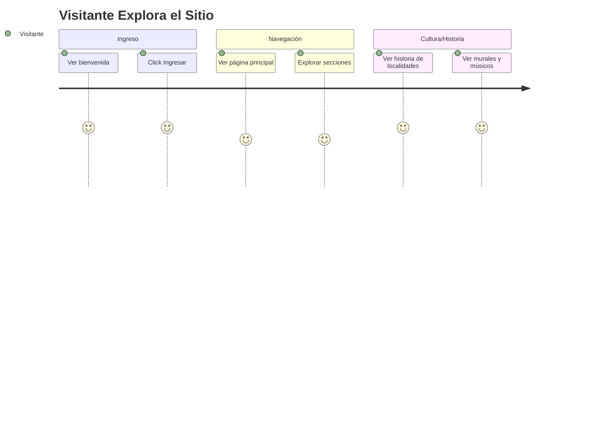
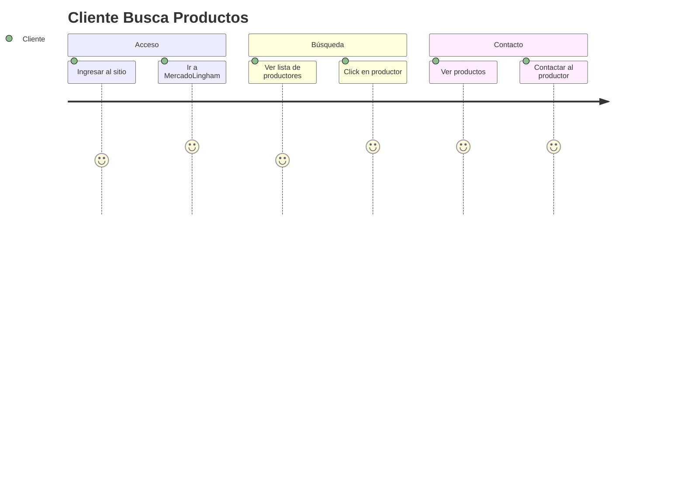
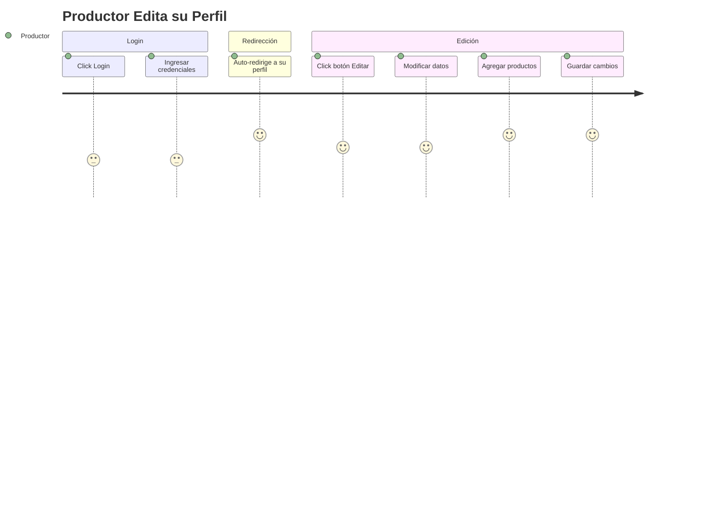
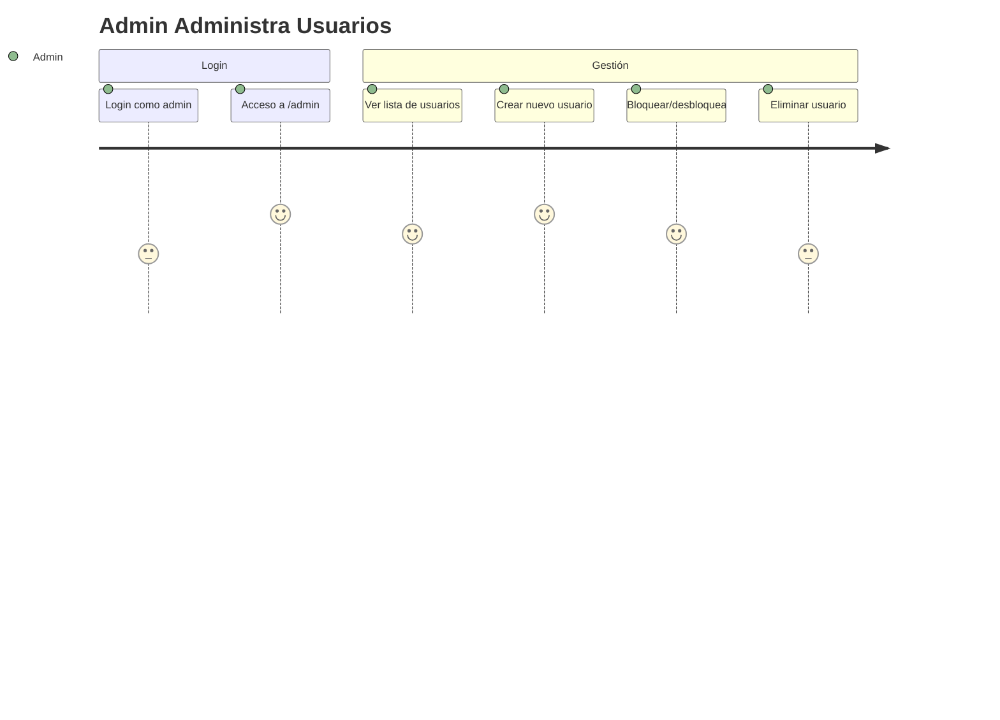

# Mapa de Rutas - Hurlingham PNO
## 📍 Estructura de Navegación

```mermaid
graph TD
    START([Usuario ingresa]) --> HOME[/homepage<br/>HomePage]
    
    HOME -->|Click Ingresar| PRINCIPAL[/principal<br/>PrincipalPage]
    
    PRINCIPAL --> EDUCACION[/educacion<br/>EducacionPage]
    PRINCIPAL --> HISTORIA[/historia<br/>HistoriaPage]
    PRINCIPAL --> CULTURA[/cultura<br/>CulturaPage]
    PRINCIPAL --> IMAGENES[/imagenes<br/>ImagenesPage]
    PRINCIPAL --> MERCADO[/mercadolingham<br/>MercadolinghamPage]
    
    MERCADO -->|Click en Productor| PRODUCER[/mercadolingham/producer/:id<br/>ProducerDetailsPage]
    
    PRINCIPAL -.->|Solo Admin| ADMIN[/admin<br/>AdminPage]
    
    ANY[Cualquier ruta inexistente] --> NOTFOUND[/*<br/>NotFoundPage]
    
    style HOME fill:#e1f5ff
    style PRINCIPAL fill:#d4edda
    style ADMIN fill:#f8d7da
    style NOTFOUND fill:#fff3cd
    style PRODUCER fill:#cfe2ff
```

## 🗺️ Jerarquía de Rutas

### Rutas Públicas

```
/
├─ /homepage (raíz - HomePage)
│  └─ Página de bienvenida con animación
│     → Botón "Ingresar" → /principal
│
├─ /principal (PrincipalPage)
│  └─ Landing principal post-bienvenida
│     ├─ Header con navegación a todas las secciones
│     └─ Imagen del municipio
│
├─ /educacion (EducacionPage)
│  └─ Visualización atómica de instituciones
│     └─ UNaHur + 3 órbitas con 17 instituciones
│
├─ /historia (HistoriaPage)
│  └─ Mapa interactivo + modales
│     └─ 3 localidades: Hurlingham, Villa Tesei, William Morris
│
├─ /cultura (CulturaPage)
│  └─ Patrimonio cultural
│     ├─ 5 músicos/bandas locales
│     └─ 8 murales de la ciudad
│
├─ /imagenes (ImagenesPage)
│  └─ Carrusel de 10 lugares emblemáticos
│     └─ Swiper con efecto coverflow 3D
│
├─ /mercadolingham (MercadolinghamPage)
│  └─ Directorio de productores locales
│     ├─ Lista de productores (API_ML)
│     ├─ Call-to-action para sumarse
│     └─ Aclaraciones legales
│
└─ /mercadolingham/producer/:id (ProducerDetailsPage)
   └─ Perfil completo de productor
      ├─ Vista pública: Todos pueden ver
      ├─ Vista de dueño: Edición + CRUD productos
      └─ Carrusel de hasta 20 productos
```

### Rutas Protegidas

```
/admin (AdminPage) 🔒
└─ Solo accesible para admin (user.name === 'admin')
   ├─ Gestión completa de usuarios
   ├─ Crear usuarios con avatares
   ├─ Bloquear/desbloquear usuarios
   └─ Eliminar usuarios
```

### Rutas de Error

```
/* (NotFoundPage)
└─ Catch-all para rutas inexistentes
   ├─ Mensaje 404
   ├─ Botón: Volver al Inicio → /homepage
   └─ Botón: Página Anterior → history.back()
```

## 🔐 Sistema de Autenticación



## 🎯 Flujos Principales de Usuario

### Flujo 1: Visitante Explorando



### Flujo 2: Cliente Buscando Productor



### Flujo 3: Productor Gestiona Perfil



### Flujo 4: Admin Gestiona Usuarios



## 📊 Estadísticas de Navegación

### Rutas por Categoría

| Categoría | Cantidad | Rutas |
|-----------|----------|-------|
| **Principales** | 2 | /, /principal |
| **Contenido** | 4 | /educacion, /historia, /cultura, /imagenes |
| **MercadoLingham** | 2 | /mercadolingham, /producer/:id |
| **Admin** | 1 | /admin (protegida) |
| **Error** | 1 | /* (404) |
| **TOTAL** | **10** | - |

### Protección de Rutas

| Tipo | Cantidad | Descripción |
|------|----------|-------------|
| **Públicas** | 9 | Accesibles sin autenticación |
| **Protegidas** | 1 | /admin - Solo admin |
| **Condicionales** | 1 | /producer/:id - Edición solo para dueño |

### Rutas con Parámetros Dinámicos

| Ruta | Parámetro | Descripción |
|------|-----------|-------------|
| `/mercadolingham/producer/:id` | `id` | ID del productor (MockAPI) |

## 🔗 Navegación desde Header

El **Header** está presente en todas las páginas (excepto HomePage con layout especial) y proporciona navegación a:

```
Header Navigation
├─ Principal → /principal
├─ Historia → /historia
├─ Educación → /educacion
├─ Cultura → /cultura
├─ Imágenes → /imagenes
├─ MercadoLingham → /mercadolingham
├─ Login (Modal)
└─ Admin → /admin (solo si user.name === 'admin')
```

## 🎨 Layouts por Ruta

### HeaderOnlyLayout
- **/homepage** - Solo Header, sin Footer

### MainLayout (Header + Footer)
- Todas las demás rutas públicas
- Rutas protegidas
- Ruta 404

## 📱 Redirects

| De | A | Condición |
|----|---|-----------|
| `/` | `/homepage` | Automático |
| Post-login (productor) | `/mercadolingham/producer/:id` | Si tiene idProductor |
| Post-login (usuario) | `/mercadolingham` | Si no es productor |
| Ruta no existente | NotFoundPage (404) | Catch-all `*` |

## 🔍 Búsqueda de Contenido por Ruta

| Ruta | Fuente de Datos | Tipo |
|------|----------------|------|
| /educacion | educacionData.js | Estático |
| /historia | historiaData.js | Estático |
| /cultura | culturaData.js | Estático |
| /mercadolingham | API_ML (MockAPI) | Dinámico |
| /producer/:id | API_ML (MockAPI) | Dinámico |
| /admin | API_USERS (MockAPI) | Dinámico |

---

## 📱 Diseño Responsive

### Breakpoints Globales

El sitio es completamente responsive con los siguientes breakpoints:

| Breakpoint | Tipo de Dispositivo | Cambios Principales |
|------------|---------------------|---------------------|
| > 1200px | Desktop | Tamaño completo (100%) |
| ≤ 1200px | Desktop pequeño | Reducción al 95% |
| ≤ 912px | Tablet / Mobile grande | Header: menú hamburguesa, Infinito: vertical |
| ≤ 768px | Tablet / Mobile mediano | Footer: layout vertical |
| ≤ 600px | Mobile pequeño | Reducción al 60% |
| ≤ 480px | Mobile extra pequeño | Reducción al 50% |

### Navegación Responsive

#### Desktop (> 912px)
```
Header: [Inicio] [Principal] [Historia] [Educación] [Cultura] [Imágenes] [MercadoLingham] ... [Login/Admin]
```

#### Mobile (≤ 912px)
```
Header: [☰ Hamburger] ... [Login/Admin]
        ↓ Click en hamburger
        [Menú Vertical]
        ├─ Inicio
        ├─ Principal  
        ├─ Historia
        ├─ Educación
        ├─ Cultura
        ├─ Imágenes
        └─ MercadoLingham
```

### Componentes Adaptativos

| Componente | Desktop | Mobile |
|------------|---------|--------|
| **Header** | Navegación horizontal | Menú hamburguesa |
| **Footer** | Horizontal (space-around) | Vertical (column) |
| **HomePage Infinito** | Círculos lado a lado | Círculos apilados (top/bottom) |
| **Títulos (Escritor)** | Tamaño completo | Escalado progresivo |

---

**Proyecto:** Hurlingham PNO  
**Total Rutas:** 10 páginas  
**Rutas Protegidas:** 1 (/admin)  
**Rutas Dinámicas:** 1 (/producer/:id)  
**Responsive:** ✅ Totalmente responsive (480px - 1920px+)
